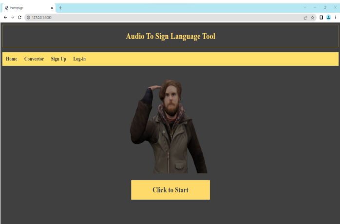
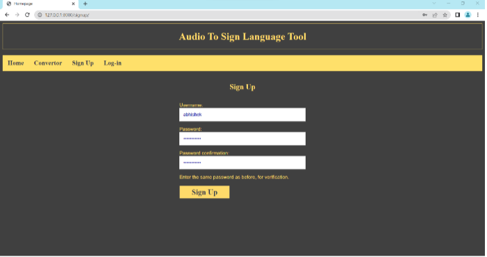
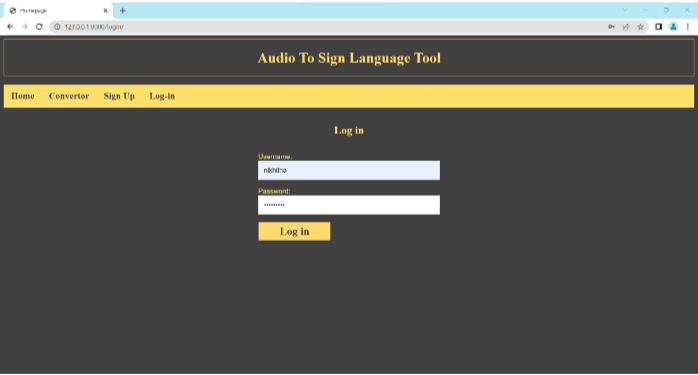
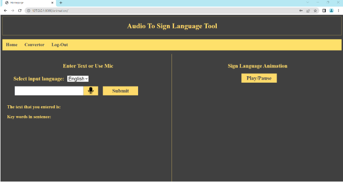
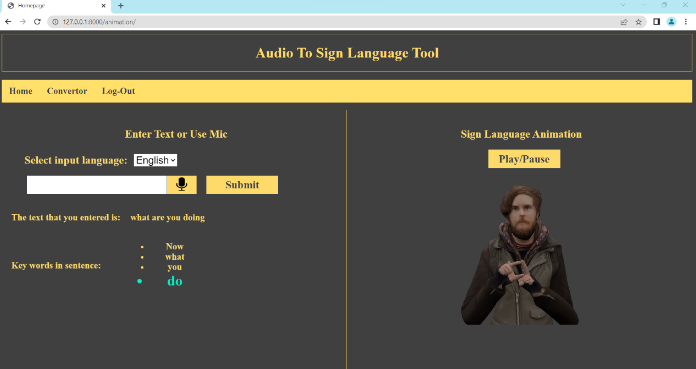

# Audio to Sign Language Converter

## Abstract

Sign language, as the primary mode of communication for the deaf community, plays a pivotal role in their social, emotional, and linguistic development. However, communication barriers persist between deaf individuals and the hearing world, hindering meaningful interaction. This project addresses this gap by developing an Audio to Sign Language Converter. By leveraging natural language processing (NLP) and computer vision technologies, this system aims to translate spoken language into sign language, facilitating seamless communication between deaf and hearing individuals.

## Overview

### Problem Statement

Deaf individuals often face challenges in communicating with non-signing individuals, leading to social isolation and limited access to information. Traditional communication methods, such as text-based messaging, may not fully capture the nuances of sign language, impeding effective communication. Additionally, the lack of widespread knowledge of sign language among the general population exacerbates these challenges.

### Proposed Solution

Our project proposes a novel solution to overcome communication barriers by converting audio messages into sign language. The system utilizes speech recognition to transcribe spoken language into text and then generates corresponding sign language gestures or animations. By providing a visual representation of the message, this system empowers deaf individuals to engage more effectively with the hearing world, fostering inclusivity and understanding.

### Key Features

- **Speech Recognition**: Utilizes advanced speech recognition algorithms to convert audio messages into text.
  
- **Natural Language Processing**: Applies NLP techniques to analyze and understand the content of the message.
  
- **Computer Vision**: Implements computer vision algorithms to generate sign language gestures or animations based on the text input.
  
- **User-friendly Interface**: Offers an intuitive and accessible interface for seamless interaction.

## Screenshots

### Homepage

### Signup Page

### Login Page

### Converter Page

### Output Generated

## Contributor

This project is contributed by [G Jahnavi Devi](https://github.com/gannemjahnavi).

## Conclusion

The Audio to Sign Language Converter project represents a significant step towards bridging the communication gap between deaf and hearing individuals. By harnessing the power of NLP and computer vision, this system not only enhances accessibility but also promotes inclusivity and empathy in society. Through continued refinement and adoption, we envision a future where communication barriers are dismantled, and mutual understanding prevails.
